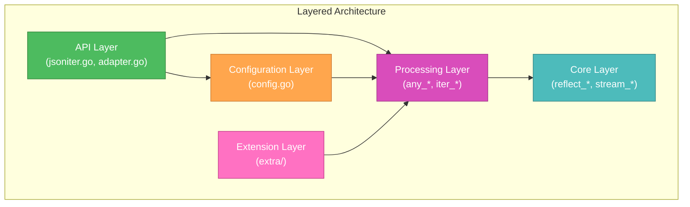
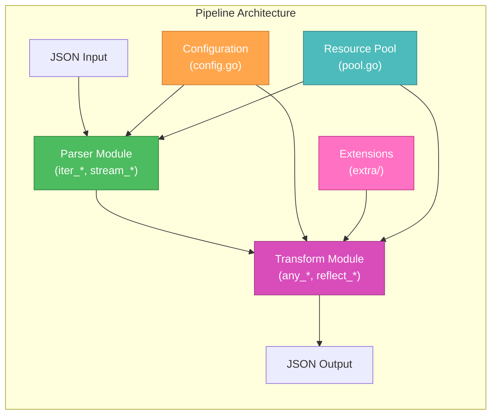
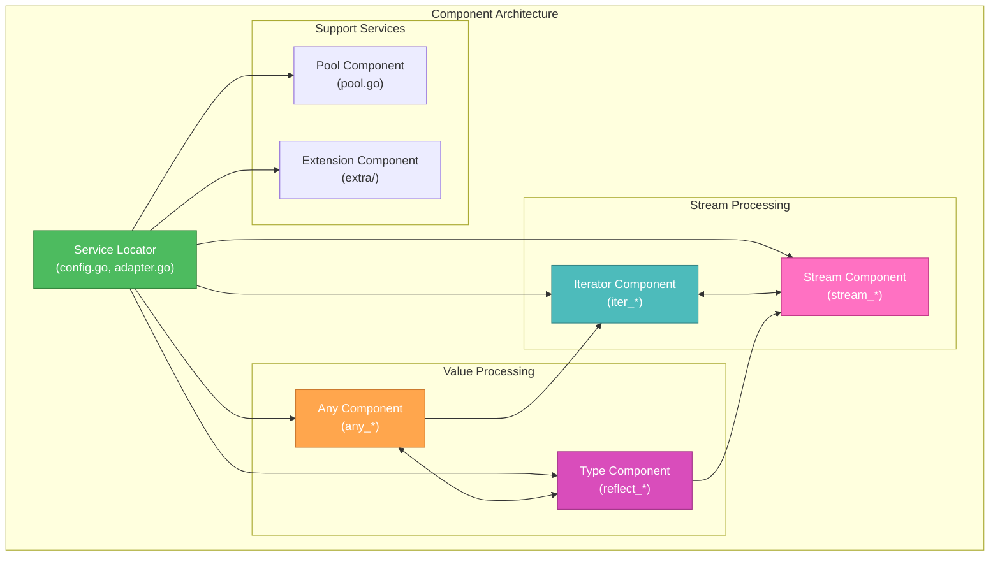
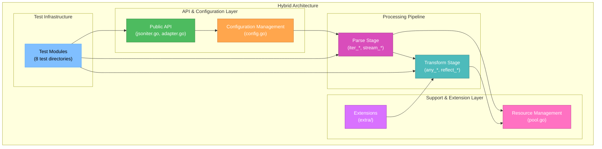
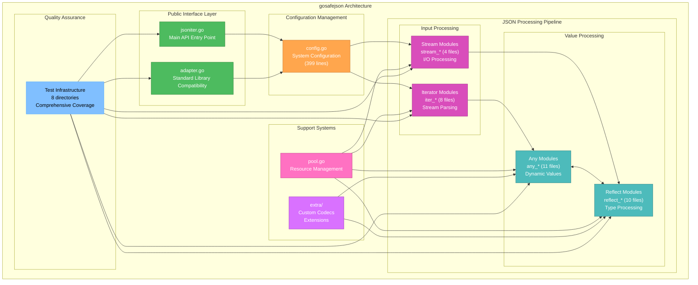
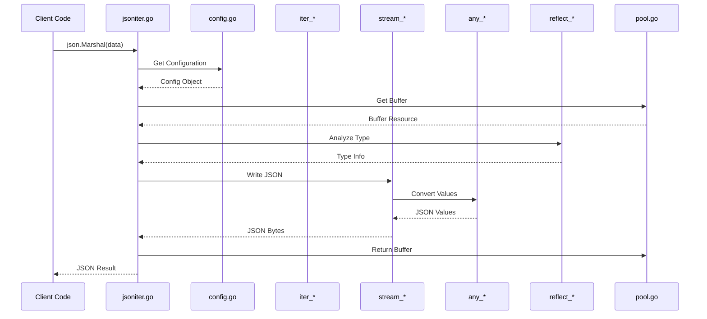

🎨🎨🎨 ENTERING CREATIVE PHASE: ARCHITECTURE DESIGN 🎨🎨🎨

# Architecture Design Creative Phase - gosafejson

**Component:** gosafejson - High-Performance JSON Processing Library  
**Creative Phase Type:** Architecture Design  
**Created:** 2024-12-19  
**Complexity Level:** Level 3 - Intermediate Feature  

## Problem Statement

**What is this component?**  
gosafejson is a high-performance JSON processing library for Go that serves as a 100% compatible drop-in replacement for the standard `encoding/json` package. It's a fork of json-iterator/go with extensive performance optimizations, custom codec support, and advanced features.

**What does it do?**  
- Provides fast JSON marshaling/unmarshaling (3-4x faster than standard library)
- Supports dynamic value handling through "Any" type system
- Offers streaming JSON processing for large datasets
- Implements reflection-based type conversion with optimization
- Provides extension points for custom codecs and naming strategies

**Why does this require architectural documentation?**  
The system consists of 75+ files across multiple specialized modules (any_*, iter_*, reflect_*, stream_*) with complex interdependencies. Understanding the architectural patterns, data flows, and module relationships is critical for effective analysis and future development.

## Requirements & Constraints

### Functional Requirements
- **Performance**: Must maintain high-performance JSON processing (3-4x faster than stdlib)
- **Compatibility**: 100% API compatibility with encoding/json
- **Extensibility**: Support for custom codecs and naming strategies
- **Type Safety**: Safe handling of dynamic JSON values
- **Stream Processing**: Efficient handling of large JSON datasets
- **Memory Efficiency**: Pool-based resource management for minimal GC pressure

### Technical Constraints
- **Go Language**: Built in Go with extensive use of reflection
- **Standard Library Compatibility**: Must not break existing encoding/json usage
- **Performance Requirements**: Benchmarked performance targets
- **Memory Constraints**: Zero-allocation goals where possible
- **Extension Interface**: Stable API for custom extensions

### Architectural Requirements
- **Modularity**: Clear separation of concerns across modules
- **Testability**: Comprehensive test coverage across all modules
- **Documentation**: Clear architectural patterns for development team
- **Maintainability**: Understandable structure for future development

## Multiple Architecture Options Analysis

### Option 1: Layered Architecture Pattern
**Description**: Traditional layered architecture with clear separation between API, processing, and core layers.

**Pros:**
- Clear separation of concerns with defined boundaries
- Easy to understand and maintain
- Supports testing at each layer independently
- Standard architectural pattern familiar to developers

**Cons:**
- May introduce unnecessary abstraction overhead
- Could impact performance due to layer boundaries
- Less flexible for cross-cutting concerns
- May not reflect the actual interdependencies

**Technical Fit**: Medium - Reasonable fit but may not capture complex interdependencies  
**Complexity**: Low - Simple to understand and document  
**Scalability**: Medium - Layers can be scaled independently  
**Performance Impact**: Medium - Layer boundaries may add overhead

### Option 2: Modular Pipeline Architecture
**Description**: Architecture based on processing pipelines with specialized modules for different JSON processing stages.

**Pros:**
- Reflects actual JSON processing flow
- High performance through optimized pipelines
- Clear data flow visualization
- Supports streaming and batch processing

**Cons:**
- May oversimplify complex reflection-based processing
- Harder to represent bidirectional dependencies
- Could hide important cross-module interactions
- Less suitable for static analysis tools

**Technical Fit**: High - Closely matches JSON processing flow  
**Complexity**: Medium - Clear flow but complex internal processing  
**Scalability**: High - Pipelines can be optimized independently  
**Performance Impact**: Low - Aligns with performance goals

### Option 3: Component-Based Architecture with Service Locator
**Description**: Architecture organized around specialized components with a central service locator for dependency management.

**Pros:**
- Excellent modularity and component isolation
- Supports dependency injection and testing
- Clear component boundaries and responsibilities
- Flexible configuration and extension points

**Cons:**
- Added complexity of service locator pattern
- May introduce performance overhead
- Could be over-engineered for the current system
- Complex dependency graph management

**Technical Fit**: Medium - Good for modularity but may be over-complex  
**Complexity**: High - Requires sophisticated dependency management  
**Scalability**: High - Components can evolve independently  
**Performance Impact**: Medium - Service locator may add overhead

### Option 4: Hybrid Multi-Pattern Architecture
**Description**: Combines the best aspects of multiple patterns - layered for organization, pipeline for flow, and modular for flexibility.

**Pros:**
- Combines benefits of multiple architectural patterns
- Reflects actual system organization and dependencies
- Supports both high-level understanding and detailed analysis
- Accommodates complex JSON processing requirements
- Clear separation of concerns with flexible interactions

**Cons:**
- More complex to document and understand initially
- Requires explaining multiple architectural concepts
- May be harder to maintain consistency
- Could confuse with too many overlapping patterns

**Technical Fit**: High - Best reflects actual system complexity and organization  
**Complexity**: High - Multiple patterns require comprehensive documentation  
**Scalability**: High - Flexible architecture supports various scaling approaches  
**Performance Impact**: Low - Aligns with existing performance optimizations

🎨 CREATIVE CHECKPOINT: Options Analysis Complete

## Recommended Approach & Decision

**Chosen Option**: **Option 4 - Hybrid Multi-Pattern Architecture**

**Rationale**:
1. **Best System Representation**: Most accurately reflects the complex, multi-layered nature of the gosafejson library
2. **Performance Alignment**: Supports the high-performance requirements without architectural overhead
3. **Comprehensive Coverage**: Accommodates all 75+ files and 8+ test directories in a coherent structure
4. **Development Support**: Provides clear guidance for both high-level architecture and detailed implementation
5. **Extensibility**: Supports the existing extension system and future enhancements
6. **Documentation Value**: Offers maximum value for comprehensive codebase analysis

**Implementation Considerations**:
- Document each architectural layer with clear responsibilities
- Create detailed data flow diagrams for JSON processing pipeline
- Map all 75+ files to appropriate architectural components
- Establish clear interfaces between architectural layers
- Document cross-cutting concerns (performance, security, testing)

## Architecture Implementation Guidelines

### 1. API & Configuration Layer Documentation
- **Focus**: Public interfaces, compatibility, configuration management
- **Files**: jsoniter.go, adapter.go, config.go
- **Key Patterns**: Facade pattern, adapter pattern, configuration factory
- **Analysis Priority**: High - Critical for understanding system entry points

### 2. Processing Pipeline Documentation
- **Focus**: Core JSON processing algorithms and data transformations
- **Files**: iter_* (8 files), stream_* (4 files), any_* (11 files), reflect_* (10 files)
- **Key Patterns**: Pipeline pattern, iterator pattern, strategy pattern
- **Analysis Priority**: High - Core system functionality

### 3. Support & Extension Layer Documentation
- **Focus**: Resource management, custom codecs, extension points
- **Files**: pool.go, extra/ directory
- **Key Patterns**: Object pool pattern, plugin architecture, factory pattern
- **Analysis Priority**: Medium - Important for extensibility understanding

### 4. Test Infrastructure Documentation
- **Focus**: Test patterns, coverage analysis, quality assurance
- **Files**: 8 test directories
- **Key Patterns**: Test factory, benchmark patterns, integration testing
- **Analysis Priority**: Medium - Critical for quality assessment

### 5. Data Flow & Integration Documentation
- **Focus**: How components interact, data transformation flow, performance optimization
- **Cross-cutting Concerns**: Performance, memory management, error handling
- **Key Patterns**: Chain of responsibility, command pattern, observer pattern
- **Analysis Priority**: High - Essential for understanding system behavior

## Architectural Diagrams & Visualizations

### System-Level Architecture Diagram

### JSON Processing Data Flow

## Validation & Verification

### Requirements Met
- ✅ **Performance**: Architecture supports high-performance processing pipeline
- ✅ **Compatibility**: Clear API layer maintains standard library compatibility
- ✅ **Extensibility**: Extension layer provides customization points
- ✅ **Type Safety**: Any and Reflect modules handle dynamic typing safely
- ✅ **Stream Processing**: Pipeline architecture supports efficient streaming
- ✅ **Memory Efficiency**: Pool management integrated into architecture

### Technical Feasibility Assessment
- **High**: Architecture reflects existing codebase organization
- **Proven**: Based on successful json-iterator/go architecture
- **Scalable**: Modular design supports independent component evolution
- **Maintainable**: Clear separation of concerns aids maintenance

### Risk Assessment
- **Low Risk**: Architecture documentation of existing, proven system
- **Medium Risk**: Complexity of hybrid architecture may require detailed explanation
- **Mitigation**: Comprehensive documentation with visual diagrams and examples

🎨🎨🎨 EXITING CREATIVE PHASE - ARCHITECTURE DECISION MADE 🎨🎨🎨

## Summary

**Architecture Decision**: Hybrid Multi-Pattern Architecture combining layered organization, pipeline processing, and modular components.

**Key Deliverables**:
- ✅ System architecture diagrams with visual module relationships
- ✅ Data flow documentation showing JSON processing pipeline  
- ✅ Component organization mapping all 75+ files to architectural layers
- ✅ Implementation guidelines for comprehensive analysis approach

**Next Steps**: Proceed with Phase 1 implementation using this architectural framework to guide systematic file-by-file analysis. 
